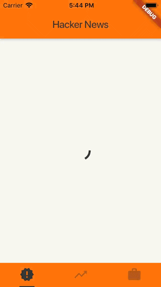
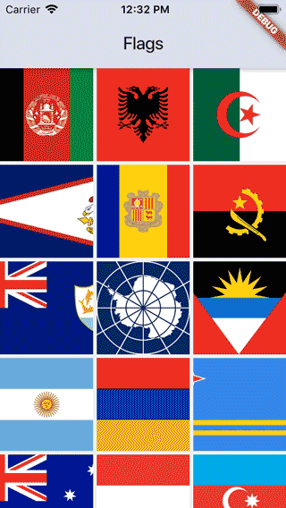
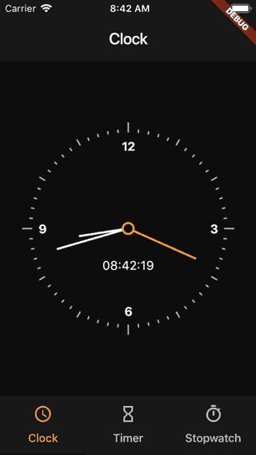
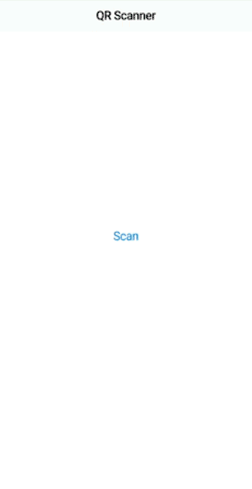
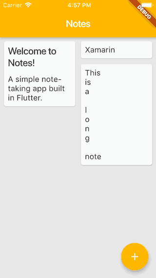
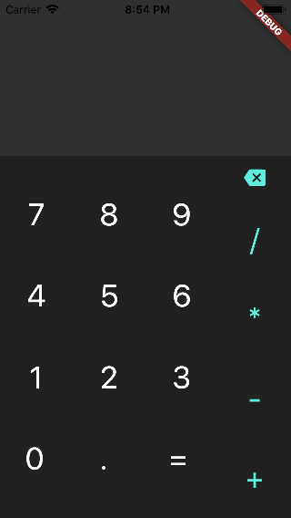
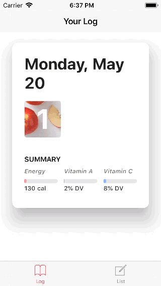

# Learning Flutter

A collection of quick projects I've completed while learning Flutter.

<table>
    <tr>
        <td align=center><a href="github_job"> github_job</a></td>
        <td align=center><a href="hacker_news"> hacker_news</a></td>
    </tr>
    <tr>
        <td align=center><a href="slack_onboarding"> slack_onboarding</a></td>
        <td align=center><a href="flags"> flags</a></td>
    </tr>
    <tr>
        <td align=center><a href="clock"> clock</a></td>
        <td align=center><a href="qr_scanner"> qr_scanner</a></td>
    </tr>
    <tr>
        <td align=center><a href="notes"> notes</a></td>
        <td align=center><a href="calculator"> calculator</a></td>
    </tr>
    <tr>
        <td align=center><a href="veggie_tracker"> veggie_tracker</a></td>
        <td align=center><a href="weather"> weather</a></td>
    </tr>
    <tr>
        <td align=center><a href="twitter_ui"> twitter_ui</a></td>
        <td align=center><a href="hello_world"> hello_world</a></td>
    </tr>
</table>