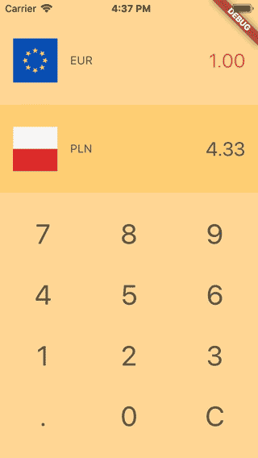
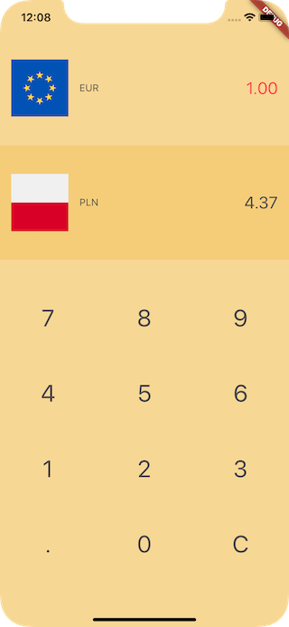
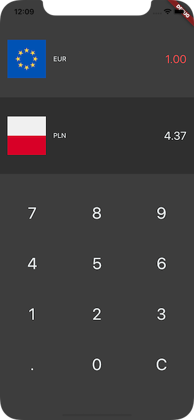

# currency_converter

A simple currency converter build using Flutter.



Flags by [Flat Icon](https://www.flaticon.com/packs/square-country-simple-flags). Exchange rates from [Exchange rates API](https://exchangeratesapi.io/).

## Overview

- The app's theme follows the device's theme

| light            | dark             |
|:----------------:|:----------------:|
|||

- By default EUR is set as the base currency, with PLN as the quote currency. These can be changed via a popup currency selector.
- Provider is used for state management.

## Remarks

- We can easily set the theme of the app by supplying `MaterialApp` a custom `theme`. Interesting there is also a `darkTheme` attribute which I hadn't noticed before:
```dart
MaterialApp(
  theme: ThemeData(
    brightness: Brightness.light,
    ...
  ),
  darkTheme: ThemeData(
    brightness: Brightness.dark,
    ...
  ),
);
```
- For some reason `Image.asset(currencyFlagAssetPath)` in `CurrencyRow` triggers two builds.
  - I suppose this is because the asset is loaded from dirty, so initially it is null and then loads?
  - Consequence is that as `CurrencyRow` is dirty, it triggers a rebuild of `ConverterPanel` and `InputPanel`.
