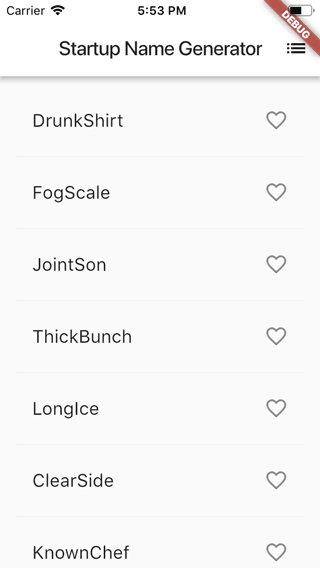

# Hello World

A simple *Hello World* project based on *Flutter*'s *Write your first Flutter app* tutorial.

Unlike the tutorial which is arguably heading in the direction of a *MWT* (Massive Widget Tree), I tried to separate view and business logic code, while separating view code to multiple dart files.

## Notes

- Hot reloading is amazing, I wish this existed years ago when I started developing apps!
- Nice touch that Flutter can be used in multiple Editors, quite happy that I can use Visual Studio Code as opposed to Android Studio.
- Inspector Mode:
    - When debugging a Flutter application, "Flutter: Inspect Widget" appears in the command palette which allows you to tap on a widget on your device/emulator to highlight it and jump directly to the source code where it was constructed.
    - Similarly, the command "Dart: Open DevTools" displays the whole widget tree in the web browser.
    - As far as I know, these are more or less the VS Code equivalents of "Flutter Inspector" on Android Studio. 
- I'm really impressed the speed at which one can code an app from scratch. I know I've read this in numerous *Medium* posts, but it's still amazing to experience first hand.
- Also really impressed at the speed in which the project is built (about 60s on an old MacBook), and hot reloaded (less than 5s). On the same machine, a Unity IL2CPP build takes 10+ mins.
- Dart is very readable, however I would have preferred if left curly braces **{** where on on separate lines.
- Overall I do not think I've been so excited about a mobile development tool since I coded my first iOS app and ran it on the simulator.

## References

[Write your first Flutter app, part 1](https://flutter.dev/docs/get-started/codelab)

[Write your first Flutter app, part 2](https://codelabs.developers.google.com/codelabs/first-flutter-app-pt2/#0)

[Effective Dart: Style](https://www.dartlang.org/guides/language/effective-dart/style)

[Dart Code v2.17.0](https://dartcode.org/releases/v2-17/)