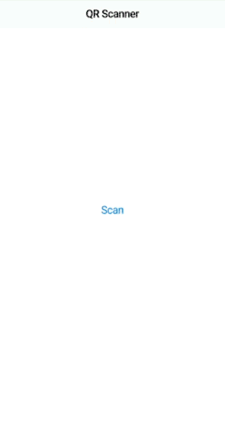

# qr_scanner

A simple QR code scanning app built in Flutter.

The goals of this project were:
- to scan a QR code and resolve it to a url
- to open a url in the device's browser
- to render the app using the Cupertino iOS theme
- to investigate swift and kotlin as native languages over objective-c and java

The following QR codes resolves to a link [flutter.dev](https://flutter.dev/) (left) or to a string *Flutter is cool* (right):
<table>
    <tr>
        <td></td>
        <td></td> 
    </tr>
</table>

## Overview

- *HomeScreen* is stateful and renders its contents depending on the enum *HomeScreenStateType*:
    - initially a scan button is presented
    - if a QR code was successfully scanned and converted to a valid url link, the link is displayed onscreen with the option to open it using the device's browser
    - if QR code's converted text isn't a valid url, an error message is displayed

## Remarks

- URL validity is checked using a regexp. Another approach could be using http package to load the page and check the response code.

## Resources

[qr_utils](https://pub.dev/packages/qr_utils)

[url_launcher](https://pub.dev/packages/url_launcher)
