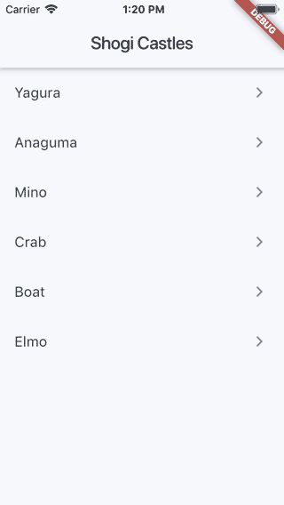

# shogi_castles

A simple Shogi Castle app built using Flutter.



Information on castles taken from [wikipedia](https://en.wikipedia.org/wiki/Castle_(shogi)).

## Overview

- `HomeScreen` displays a list of shogi castle names, taping on a name opens `CastleScreen` displaying the chosen castle.
- `ShogiBoard` renders a game board with a `List<Position>` of game pieces. `BoardCell` renders a cell of the board, and the game piece on top, if applicable.

## Remarks

- Most of this code could be self-contained within its own package, especially as there is presently no shogi board package on pub.dev. One thing that would need to be worked on is promoted pieces.
- As there doesn't seem to be any type of shogi castle app presently available, this could be an interesting project to work on.
- Instead of using `CastleProvider`, it would be much easier to supply positions as an array of strings, and then create a list of positions using a utility method. These positions should also be ion normal notation (that is, not index 0-8 notation).
```json
{
    name: "Yagura",
    positions: [
        "L99",
        "N98",
        "K88",
        "G87",
        "P79",
        "P78",
        "S77",
        "G76",
        "P67",
        "P66",
        "P65",
    ]
}
```
