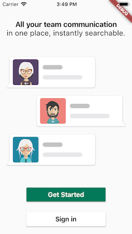
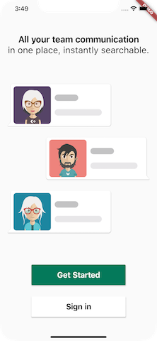

# slack_onboarding

A simple app inspired by the first page of Slack's onboarding.

The goals of this project were:
- to create an adaptive UI using proportional widths, heights and font sizes
- to explore basic animations for widgets like fade-in and slide-down

## Overview

- The onboarding page is divided into three sections, top, middle and bottom, whose elements sizes are proportional to the screen width and height, and animate according to a specified timeline.
- The chat bubbles are created using the *bubble* package by Victor Dunaev, with avatar assets by kubanek. The chat message is simply created using a filled container with circular border radius.

## Remarks

- By considering proportional widths and heights for widgets and proportional font sizes, it is possible to to adapt to devices of different resolutions and aspect ratios:

|  | |
|:-------------:| :-----:|
| iPhone 5s | iPhone XS Max |
| 640×1136 (9:16) | 1242x2688 (9:19.5) |

- Although this approach also works for iPad in portrait, practically a separate design would generally be needed as the elements would be far too big.
- It does not seem to be possible to animate a column (see bottom_section), or maybe I missed something?
- With regard to project structure, /configs seems like a better place for constants than /utils.

## Resources

[bubble](https://pub.dev/packages/bubble) 

[People wearing accesories avatar collection vector created by kubanek - www.freepik.com](https://www.freepik.com/free-vector/people-wearing-accesories-avatar-collection_1176016.htm)
