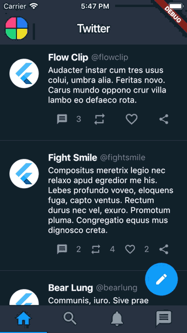

# Twitter UI

A simple Flutter project (roughly) replicating Twitter's main screen UI.

## Overview

- *User*, *Tweet*, *Trend* and *Notification* are models representing a user, tweet etc.
- *TwitterService* returns a pre-defined user (me!), some fake tweets, trends and notifications using [*english_words*](https://pub.dartlang.org/packages/english_words) and [*flutter_lorem*](https://pub.dartlang.org/packages/flutter_lorem) packages.
- The app's colors are defined in *AppColors* and used to style the app's theme.
- The app only contains one screen, *HomeScreen*, which contains a drawer *NavigationDrawer* and a *TabBarView*.
- *HomeTab*, *SearchTab*, *NotificationsTab* and *InboxTab* are custom (tab) widgets.
- *TweetWidget*, *TrendWidget* and *NotificationWidget* are custom widgets for a tweet etc.
- As the app makes use of *NetworkImage*, *INTERNET* is added as a permission in the (main) *AndroidManifest*. Note that there is no error handling, so if the device doesn't have an internet connection, an exception will be thrown.

## Remarks

- In dart the keyword *new* is optional, thus for readability I have omitted it.
- Splitting widgets to methods is a performance anti-pattern (see below for more information), thus anytime a widget could be redrawn, I opted for custom widgets over methods.
- I am impressed the speed at which one can build simple UIs. Initially I was quite skeptical in having to write all ui code manually, but these widgets are insanely powerful and intuitive.
- I'm still not sure how to structure a flutter project. *models*, *services* and *utils* folders make sense, but I am not sure how to really organize the views.
- For custom widgets it seems to be generally best to supply a key so that the widget can be reference to later now. This is something I will look into more.
- The release build (without any optimization) is 19.26MB and 28.5MB on Android and iOS respectively.

## References

[Splitting widgets to methods is a performance anti-pattern](https://iirokrankka.com/2018/12/11/splitting-widgets-to-methods-performance-antipattern/)

[Never ever use functions over classes to make reusable widget-tree](https://stackoverflow.com/questions/53234825/what-is-the-difference-between-functions-and-classes-to-create-widgets/53234826#532348260)

[Should I add a Key property to my custom widgets?](https://github.com/flutter/flutter/issues/3868)
