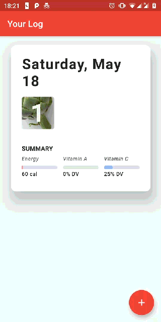
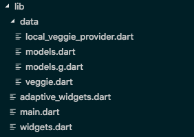
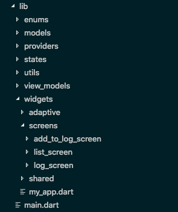

# veggie_tracker

A simple Flutter project which tracks veggies eaten based on the [*Building for iOS with Flutter*](https://www.youtube.com/watch?v=ZBJa-xjZl3w) talk at Google I/O'19.

<table>
    <tr>
        <td></td>
        <td></td>
    </tr>
</table>

## Overview

- *veggie_tracker* adapts the user experience by using a flat navigation architecture based on **CupertinoTabScaffold** on iOS, and a hierarchical navigation on Android. There are also a number of smaller adaptations of the UI like different buttons, background colors etc.
- [*provider*](https://pub.dev/packages/provider) is used to share state across the app.
- I personally did not like or find the Material drawer useful on Android, thus I replaced it with a simple **FloatingActionButton**.
- A Veggie's season wasn't actually displayed on screen, so I decided to rectify this in *AddToLogForm*.
- One of the challenges in Flutter is how to structure the project folder. Thus one of my goals for *Veggie_tracker* was to take the original structure (left) and separate it out into folders and files which I find intuitive (right).

<table>
    <tr>
        <td></td>
        <td></td>
    </tr>
</table>

## Remarks

- To become better acquainted with json serialization, instead of using the [*json_serializable*](https://pub.dartlang.org/packages/json_serializable) package, I manually took care of serializing and deserializing. Although this isn't difficult, there is a lot of boilerplate code.
- *lib/widgets/adaptive* could be extracted out to their own package.

## License

Based on [Building for iOS with Flutter, Google I/O '19](https://github.com/RedBrogdon/building_for_ios_IO19) by [Andrew Brogdon](https://github.com/RedBrogdon) and [Brett Morgan](https://github.com/domesticmouse), licensed under BSD 3-Clause. [Full details](https://github.com/RedBrogdon/building_for_ios_IO19/blob/master/LICENSE).
