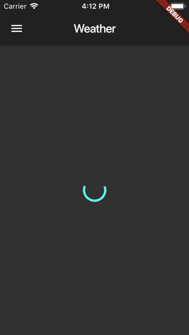
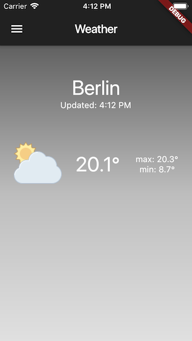
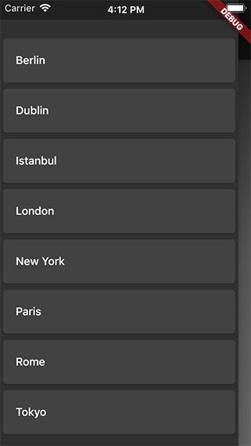
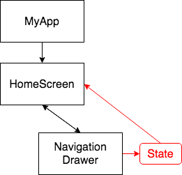

# weather

A simple weather app inspired by [*flutter_weather*](https://github.com/felangel/Bloc/tree/master/examples/flutter_weather) by Felix Angelov. Image assets by [icons8](https://icons8.com/icon/set/weather/office).



As the background uses a gradient, the above gif didn't come out too well. Here are some still screenshots:

<table>
    <tr>
        <td></td>
        <td></td>
    </tr>
</table>

## Overview

- The app uses the [metaweather](https://www.metaweather.com/) API, specifically:
  - ```/api/location/search/?query=$city``` to determine a *locationId* for a given city
  - ```/api/location/$locationId``` to determine the weather for a given *locationId*
- Although a forecast for the forthcoming days is returned, only today's weather is considered.
- *lib/models/weather_model* is a model of a weather forecast.
- *lib/services/weather_service* is a service which handles weather requests.
- WeatherService returns a json results which is (manually) deserialized into a Weather model. **Note** that there is no error handling for an active internet connection.
- The app's widget tree is pretty simple:
- 
- *NavigationDrawer* is a drawer where the user can select a city. This state then needs to be passed to *HomeScreen* so that a weather forecast can be requested and displayed. Although this could be achieved by setting HomeScreen to be stateful and passing a callback to NavigationDrawer, I decided to use *provider* due to its ability to decouple these widget in an intuitive manner.

## Remarks

- The [json_serializable](https://pub.dev/packages/json_serializable) package can auto-generate an object's serialization/deserialization code.

## Resources

[provider](https://pub.dev/packages/provider)

[Flutter: State Management](https://flutter.dev/docs/development/data-and-backend/state-mgmt)